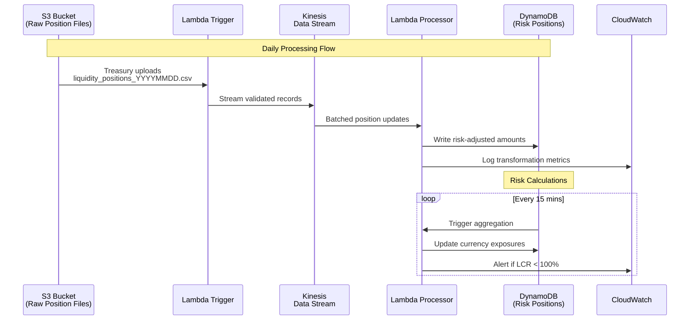
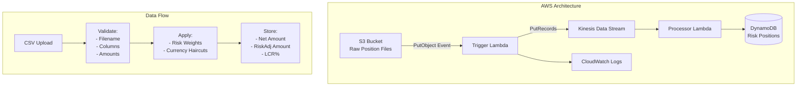

# Bank Liquidity Risk Management System

A comprehensive AWS-based system for managing liquidity risk in banking operations, designed to handle large-scale financial data processing and ensure regulatory compliance.
-
- 
-
## Architecture Overview

The system follows a serverless, event-driven architecture:

1. **Data Ingestion**: S3 triggers Lambda functions when new financial data files are uploaded
2. **Stream Processing**: Kinesis Data Streams handle real-time data processing
3. **Risk Calculation**: Lambda functions perform liquidity risk calculations (LCR, NSFR)
4. **Data Storage**: DynamoDB stores processed data and risk metrics
5. **Monitoring**: CloudWatch provides comprehensive monitoring and alerting

## Key Features

- **Regulatory Compliance**: Implements LCR and NSFR calculations per Basel III
- **Stress Testing**: Automated stress testing with configurable scenarios
- **Real-time Processing**: Stream-based processing for near real-time risk monitoring
- **Scalability**: Handles large files and high-volume data processing
- **Security**: End-to-end encryption and least-privilege access controls
- **Audit Trail**: Comprehensive logging for regulatory audit requirements

## Components

### Core Services

- `S3Service`: Handles file operations with compression and encryption support
- `KinesisService`: Manages stream processing and batch operations  
- `DynamoDBService`: Provides data persistence with automatic scaling
- `LiquidityRiskTransformer`: Implements financial risk calculations

### Lambda Functions

- `s3_trigger_handler`: Processes uploaded files and initiates data pipeline
- `kinesis_processor`: Performs risk calculations and stores results

### Infrastructure

- Terraform configurations for reproducible infrastructure deployment
- Serverless Framework for Lambda function deployment and management
- CloudWatch alarms for proactive monitoring

## Deployment

### Prerequisites

- AWS CLI configured with appropriate permissions
- Terraform >= 1.0
- Node.js and Serverless Framework
- Python 3.9+

### Quick Start

```bash
# Clone the repository
git clone <repository-url>
cd bank-liquidity-risk-management

# Install dependencies
pip install -r requirements.txt
npm install -g serverless

# Deploy to development environment
./deployment/deploy.sh dev us-east-1

# Generate test data
python scripts/test_data_generator.py

# Run tests
python -m pytest src/tests/ -v
```

### Configuration

Environment variables and configuration can be customized in:
- `src/config/settings.py` - Application settings
- `terraform/variables.tf` - Infrastructure parameters
- `serverless.yml` - Serverless configuration

## Usage

### Data Upload

Upload CSV, JSON, or Parquet files to the configured S3 bucket. The system automatically:
1. Validates and cleans the data
2. Processes it through the risk calculation pipeline
3. Stores results in DynamoDB
4. Publishes metrics to CloudWatch

### Monitoring

Access the system health through:
- CloudWatch dashboards for real-time metrics
- CloudWatch alarms for critical alerts
- DynamoDB tables for detailed risk data

### API Access

Query risk data using DynamoDB APIs or build custom dashboards using the stored metrics.

## Data Models

### LiquidityPosition
- Position-level financial data with risk attributes
- Supports multiple asset classes and currencies
- Includes data quality scoring

### RiskMetrics  
- Calculated risk ratios (LCR, NSFR)
- Compliance status indicators
- Historical trend data

### ComplianceRecord
- Regulatory compliance tracking
- Violation and remediation records
- Audit trail information

## Security

- All data encrypted at rest and in transit
- Least-privilege IAM roles and policies
- VPC isolation for sensitive resources
- Comprehensive audit logging

## Compliance

The system supports major regulatory frameworks:
- Basel III (LCR, NSFR)
- CCAR (Comprehensive Capital Analysis and Review)
- DFAST (Dodd-Frank Act Stress Testing)
- CECL (Current Expected Credit Loss)
- IFRS 9 (International Financial Reporting Standards)

-
-
## Liquidity Risk Monitoring System
*Real-time processing of global cash positions for Basel III compliance*



### Key Features
1. **Automated Ingestion**
   - Processes files from `s3://<bucket>/raw/<region>/YYYY/MM/DD/`
   - Validates file structure via `src/utils/validators.py`

2. **Risk Transformation**
   ```python
   # src/models/transformation_models.py
   def apply_risk_weights(amount: float, currency: str) -> float:
       return amount * RISK_WEIGHTS[currency]  # Basel III haircuts
   ```

3. **Regulatory Monitoring**
   - Real-time LCR (Liquidity Coverage Ratio) tracking
   - Threshold alerts in `monitoring/cloudwatch_alarms.py`

4. **Data Flow**
## Liquidity Risk Monitoring System


5. **Usecase 1**


### Usage Example
```bash
# Deploy for EMEA region
cd terraform
terraform apply -var="region=eu-central-1" -var="env=prod"
```

**Compliance Targets**
- ✅ 30-minute position freshness (Basel III)
- 🔄 99.9% event processing success
- 🚨 <5 minute alert latency
-
-


## Support

For technical support or questions:
1. Check the troubleshooting guide in `docs/troubleshooting.md`
2. Review CloudWatch logs for error details
3. Submit issues through the project repository

## License

This project is licensed under the MIT License - see the LICENSE file for details.
"""